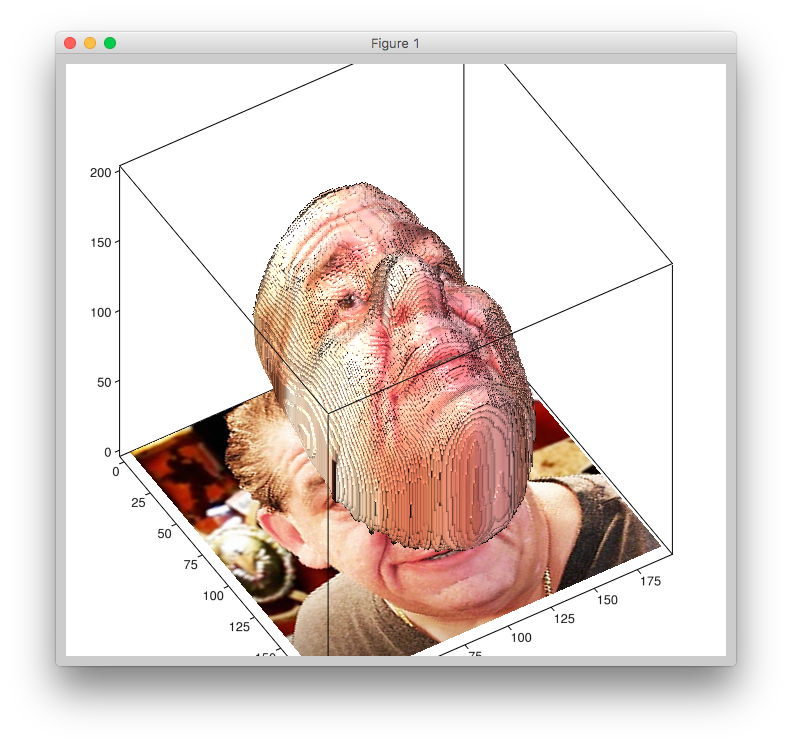

# vrn-torch-to-keras
Transfer pre-trained VRN model from torch to Keras

### Source of original model
"Large Pose 3D Face Reconstruction from a Single Image via Direct Volumetric CNN Regression"
https://github.com/AaronJackson/vrn<br>
Download: http://cs.nott.ac.uk/~psxasj/download.php?file=vrn-unguided.t7

### Script used to parse t7 file
https://github.com/bshillingford/python-torchfile

### Resulting Keras model
https://drive.google.com/file/d/1oh8Zpe4wh00iXcm8ztRsi5ZL6GMkHdjj/view?usp=sharing

### Usage
```python
from keras.models import load_model
import custom_layers
custom_objects = {
    'Conv': custom_layers.Conv,
    'BatchNorm': custom_layers.BatchNorm,
    'UpSamplingBilinear': custom_layers.UpSamplingBilinear
}
model = load_model('vrn-unguided-keras.h5', custom_objects=custom_objects)
```
Input is 3 x 192 x 192 (channels first)<br>
You will need to install h5py.

See [Example-Usage.ipynb](./Example-Usage.ipynb) for a full example using pyplot and visvis

### Tensorflow model
https://drive.google.com/file/d/1THX-x6TR8Qg7zFfaFXU3cFd9PCZp22IY/view?usp=sharing

```python
from tensorflow.core.framework import graph_pb2
with open('vrn-tensorflow.pb', "rb") as f:
    output_graph_def = graph_pb2.GraphDef()
    output_graph_def.ParseFromString(f.read())
    _ = tf.import_graph_def(output_graph_def, name="")

x = sess.graph.get_tensor_by_name('input_1_1:0')
y = sess.graph.get_tensor_by_name('activation_274_1/Sigmoid:0')

img = cv2.imread('joey.jpg')
img = cv2.resize(img, (192, 192))
b,g,r = cv2.split(img)
img = cv2.merge([r,g,b])
img = np.swapaxes(img, 2, 0)
img = np.swapaxes(img, 2, 1)
img = np.array([img])

pred = sess.run(y, feed_dict={x: img})
```


